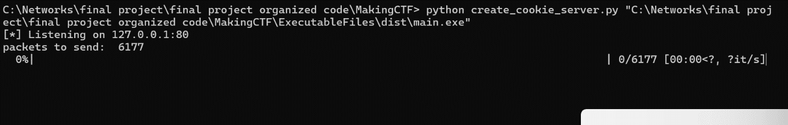
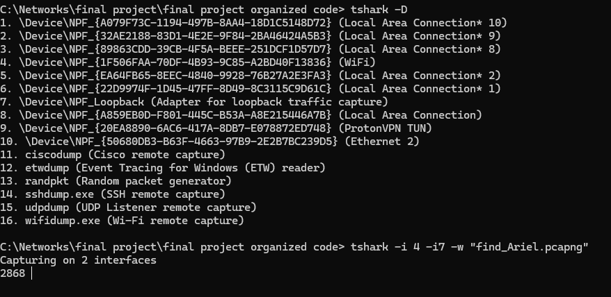
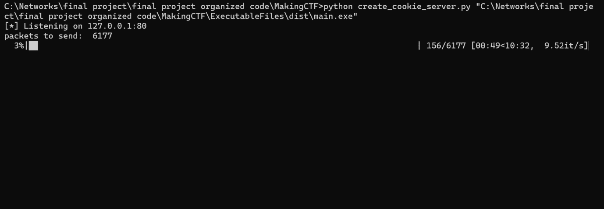

# The Making
Here you can find explanations to the making of the CTF

## Creating Stage 4: RSA encryption 
 First I needed to decide on a public key and modulus such that the totient of the modulus and the public key are coprime (i.e. the greatest common factor of the totient of the modulus and the public key is 1). I wanted to hover around a public key value such that I can get the year 1977 from another number and a public key (and easily see the year 1977) for the hint of this, since the RSA algorithm was developed in that year and use a smaller number to prevent possible value overflows when not directly using the RSA library. So, I decided on  p and q values of 53 and 61 which yielded a modulus of 3233, and a totient of 3120. I then found based off the totient, that I can use the value 17 and the public key. I then encrypted my message by taking the ascii value of every character in the message, and applied the formula “ascii_value^17 mod 3233” to every ascii value. The script used to complete this task can be found [here](RSA_encryptor.py)

 ## Creating Stage 3: HTTP query parameters 
  For this stage I needed to create a basic HTTP server that would process the URL of the get requests of the client, and determine if they used the proper query parameters and the proper values for the query parameters. Several html files were created for the purpose of hinting to the player the proper direction that he was meant to go:


- [no_parameters.html](ExecutableFiles/webroot/html_files/no_parameters.html): This page is sent on the initial visit to student_finder.co.il without query parameters. It tells the player to query with their login information. The page was sent with a 401 unauthorized (as they are unauthorized to see the final message).
- [requested_not_from_root.html](ExecutableFiles/webroot/html_files/requested_not_from_root.html): This page is sent when the player tries to search in any directory (or for any file) besides a basic search for the website (excluding the css file or images) For example, if the player uses the url student_finder.co.il/answers, they will be sent this page as they are not searching specifically from the root directory). It tells the player that there is no purpose in searching in other directories of the website, and to just use their login information. The page is sent with a 404 not found.
- [bad_file_searcher.html](ExecutableFiles/webroot/html_files/bad_file_searcher.html): For the sake of easing the logic needed in the HTTP server, any image was linked in their specified html file as if they were put in the “hidden” directory (a directory that only exists on the client side, but does not actually exist on the server side). If the player makes a direct request to the hidden directory, but searches for a file that does not exist, this page will be sent, indicating that while the player was clever to try to search for answers directly within this directory, they failed to look for a file that existed, and that nothing in this directory will help them unless they use proper query parameters. This page is sent with a 404 not found. (A request for files that do exist will be handled by plainly sending those files, i.e. images).
- [missing_username.html](ExecutableFiles/webroot/html_files/missing_username.html) , [missing_password.html](ExecutableFiles/webroot/html_files/missing_password.html): These pages are sent if the player did not query with a username or a password respectively. These pages are sent with a 401 unauthorized.
- [wrong_values.html](ExecutableFiles/webroot/html_files/wrong_values.html): This page is sent if the player used proper parameters (username and password), but improper values for either one. The page is sent with a 401 unauthorized.
- [not_sure_how_this_was_sent.html](ExecutableFiles/webroot/html_files/not_sure_how_this_was_sent.html): For the sake of the robustness of the server, this default page is sent if an unpredicted request was made, though it is expected to never be sent. The page is sent with a 404 not found.
- [goal.html](ExecutableFiles/webroot/html_files/goal.html): This page is sent if the player used the proper parameters and proper values. It is sent with a 200 OK.
Additional files the server handled were images, a favicon, and a css file that were linked to in the html files. From the client side, images appear in the hidden directory, a directory that does not exist, but was added via the client side to ease the logic needed for the server.
As the server would be running a localhost, I wanted to make sure that the header of the get request contained “Host: student_finder.co.il” so a special method was added for that. A request for any other host, (or if the get request was missing the “host” field), the server would simply ignore the request (and send a 421 misdirected request error) as in a real-world situation, this is an issue in DNS. 
Once the goal page is sent, the server sets a counter to limit to two more requests (requests for the image of the goal page and the css file, we would assume at this point the favicon was cached and there would not be another request for it, otherwise, the favicon would just not be sent) and after handling these last two requests the server would shut down.
‘os.path.dirname(__file__)’ was used for file resolution so no matter which directory the files existed in, we would always append the local “root” directory to the file path. This was important for the purpose of creating the executable, such that the “webroot” directory appeared in the root directory of the executable. 
The files that make up the HTTP server can be found in MakingCTF\ExecutableFiles\http_server.py for the HTTP server itself, MakingCTF\ExecutableFiles\protocols.py for the various protocols and global variables, and MakingCTF\ExecutableFiles\webroot for all other files (html, css, images) needed for the server.

## Creating Stage 2: DNS, Socket programming, TLS Certificates 
 To create the certificate, I used python’s cryptography library as well as the certificate builder functions. This allowed me to define the standard object identifiers (cname, organization, etc) for a fake issuer and a fake subject (which is the same subject found in the upcoming stages student_finder.co.il). I added validity dates to the certificate to maintain the standard build in a certificate. I then added unrecognized extensions with random object identifiers for the purposes of the CTF as instructions for stage 3 and labeled them as critical to hint that they must be understood and are critical for the use of the certificate, and solving the CTF. I arbitrarily used the sha256 hashing algorithm and signed the certificate with an RSA private key that was generated using python’s RSA library (The certificate is self-signed). Finally, I serialized the certificate in PEM (privacy enhanced mail) format. After all of this was accomplished, I dealt with handling the sending of the certificate to a server that the player would create, as we use a socket object, and we attempt to create a connection to the domain “student_finder.co.il” which does not exist, so the player must map this domain to the localhost IP. For sending the certificate, a simple protocol was devised. First, the client sends a message regarding the size of the file, which the server is expected to echo with an OK: ‘size’. Then the client asks for permission to send the file, and the server grants that permission. Finally, the client sends the file, and the server can already read the exact amount it is meant to read from the socket to get the file as the size had been previously sent. At all steps, if the server does not follow the protocol, the client prints hints to the console about the exact protocol the server must follow and shuts down (also preventing the HTTP server of the next stage from running). The scripts that accomplish these tasks can be found [here](ExecutableFiles/certificate_creator.py) for the actual driver code and [here](ExecutableFiles/protocols.py) for any global variable used.

## Creating Stage 1: Wireshark, HTTP cookies, Scapy, PE format
Now that all the files needed for the executable were written, I wrote the main.py file whose purpose was just to call the certificate_creator.py driving function and the http_server.py driving function, and catch any exception that was not already caught and dealt with within either of those files. The script can be found [here](ExecutableFiles/main.py).
I then used pyinstaller to actually created the executable by running the following command in the command line:
```cmd
pyinstaller --add-data “webroot;webroot” --onefile  main.py
```

- add-data “webroot;webroot” to place the files in the webroot directory (html, images, css) into a newly created webroot directory in the executable so file resolution will act as expected.
- onefile so the entire executable (including dependencies and resources) would be bundled into a single file as opposed to creating an executable along with multiple files needed for its execution.

The original executable can be found [here](ExecutableFiles/dist/main.exe).

Now I needed to create a mock server and mock client to cut up the executable, and send it in a way Wireshark would recognize as HTTP packets.
The server accomplishes the following:
- Open the executable file for reading bytes.
- Break up the executable into chunks of 2000 bytes and base64 encode each chunk.
- Open a socket to receive connection requests, and to subsequently send the chunks to the socket object created when a request is received.
- Constantly receive requests and send data with a HTTP header containing a unique field (“The-Supermarket”: shufersal) until the executable file has been completely sent and then send a dummy message (“DONE”) to indicate there is no more data to send, then shut down.

The script that accomplishes this can be found [here](create_cookie_client.py) and is run in the command in the by passing a file as an arguments like so:
```cmd
python python create_cookie_server.py  path\to\main.exe
```

NOTE: This script using the module tqdm and must be installed prior to running the script.

The client accomplishes the following:
- Connect to the socket created in the server.
- Send a simple Get request.
- Receive data from the server, then close the connection.
- Sleep for 0.1 seconds so the relevant packets for the CTF would not appear right next to each other in the  Wireshark capture.
- Repeat these steps until receiving the dummy message (“DONE”) then shut down.

When first starting up the server, the following pops up to show that that the server is ready to start sending the data: 


The tqdm package was used to help me monitor the progress of the packets being sent, as I wanted to know when to stop the Wireshark capture as well as send mock packets using other scripts to clutter and provide hints. We see here that there are 6177 packets that need to be sent, 6176 for the packets actually containing the executable, and 1 to send “DONE”.

At this point, I sought to give other packets some meaning in the Wireshark capture that were not directly related to HTTP, however if inspected the player can find hints of what to actually filter for in the capture. These packets are meant to show up at the beginning of the capture, as well as throughout. For this purpose, I made three different scripts to send various ARP “Who Has” requests, DHCP discover requests, and ICMP echo requests. The python files with the functionality described are as follows:

- [ARP_request.py](ARP_request.py): Using SCAPY, I set up the layers needed to make an ARP “Who Has” request. I generate two random IP addresses and a random MAC address. I then set up the ARP layer with the OP code as 1 signifying  an ARP “Who has” request from one of the random IP addresses to the other. I finally set up the ethernet layer with the random MAC address as the source MAC address and the broadcast MAC address as the destination (because in ARP, we do not know the MAC address associated with the destination IP address). I also set up a RAW layer in which I include a hint (“would you say “The-Supermarket” is a unique header?) Finally, I  stack up the layers and send the packet. This process is repeated every 0.1 seconds.
- [DHCP_sender.py](DHCP_sender.py): Using SCAPY, I set up the layers needed to make a DHCP discover request. I first choose a random MAC address, then create the ethernet layer with the source being that random MAC address and the destination being the broadcast MAC address  (as in DHCP we originally do not know the MAC address of the server. I then set up the IP layer with the source IP being 0.0.0.0 and the destination being the limited broadcast address (as the source device does not yet have an IP address, and does not know the IP address of the DHCP server). After this I set up the UDP layer with the source port being 68 and the destination port being 67 as lined out by the protocol. I then set up the BOOTP layer to set up a random transaction ID and turn on the broadcast flag (so a server will respond via broadcast as opposed to unicast to a specific IP, since the client does not yet have an IP address) which is what is usually is done during a request. I finally set up the DHCP layer, and within the options I use the “vendor_class_id”, which is generally used to indicate the hardware of the device making the request, to put in a hint for what to filter for in the capture (“what protocol does a browser use to communicate with the server?) . Finally, I stack the layers and send the packet. This process is repeated every 0.1 seconds.
- [ICMP_ping.py](ICMP_ping.py): Using Scapy, I create ICMP echo requests. First, I choose a random IP address. I then set up my packet with an IP layer with the destination as the fake IP address from above, an ICMP layer with type 8 for echo requests and an RAW layer with a hint (“what type of snack is an oreo?”). I then send the packet and wait 0.5 seconds for a response (as to capture those packets too as they will ultimately contain the hint as well because this is an echo request). This process is repeated every 0.1 seconds.

To run all of these files together in one script (as well as to run them in threads so they all could run concurrently), I wrote a script that created a thread for each action, and executed each action until a keyboard interrupt to stop execution (as all of the actions specified above were infinite loops). This allowed me to handle all three actions together easily.  The script that accomplishes this can be found [here](clutter_and_hints_for_capture_file.py).

I was now finally ready to start capturing packets for the Wireshark file. I had already started the server responsible for sending the HTTP packets with the executable in the Set-Cookie’s header. I then began the execution of the script described above to send the various ARP, DHCP, and ICMP packets. As the create cookie server would send packets via the loopback interface, and the packets that contained hints would be sent via the wifi interface, I needed to capture from both of these interfaces in a single capture. To do this easily I used the Wireshark’s command line interface tshark.

I first used the tshark -D command to find the interface numbers for wifi and loopback, and then  ran the command tshark -i #wifi -i #loopback -w find_Ariel.pcapng (after having identified the interface numbers) to capture from both interfaces and to write the packets captured to the file find_Ariel.pcapng:


At this point I began running the client script described earlier in this document to finally begin the transmission of HTTP packets. I was able to monitor the relay of the executable as well.


After the executable was done being processed, I simply ended the capture, stopped the execution of the hints file, and completed the CTF.
