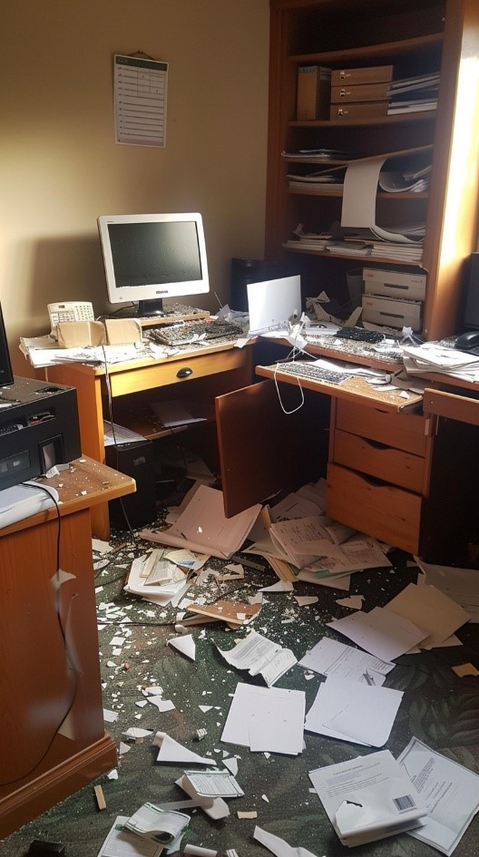

# CTF in Networks

### Welcome To the Networks Capture the Flag Challenge.
Ariel has gone missing! Do you have what it takes to find him? Sniff the packets, follow the clues, and bring Ariel back home! 

#### Prerequisites
- Understanding in Networks and Operating Systems
- Python
- Wireshark
- SCAPY
- Windows
- WSL

## Backstory

Ariel was known to everyone as a diligent and dedicated student. Always on top of his assignments and frequently seen in the library, Ariel was the kind of student every teacher wished for. His keen interest in networking and knack for solving complex problems made him a standout student in his class.
Ariel's routine was predictable, almost methodical. He attended his lectures punctually, participated actively in study groups, and spent countless hours honing his skills in the computer lab. His professors admired his dedication, and his peers often sought his help with their projects. It was no surprise when Ariel started to assist Professor Y, a renowned networks expert, in various research projects. Their collaboration promised to yield significant advancements in computer science.
However, something unusual happened one day. Ariel did not show up for his morning lecture, and his friends had not seen him since the previous evening. Messages went unanswered, and calls went straight to voicemail. Concern grew among the faculty and students as the hours passed with no sign of Ariel. The situation escalated, and a search was initiated.
Professor Y, who had grown quite fond of Ariel, took it upon himself to find his missing student. With the university administration's approval, he began a thorough investigation. The search led him to Ariel's dorm room, which appeared undisturbed. On Ariel's desk lay a stack of textbooks, a half-finished assignment, and his prized laptop, still humming from recent use. Amid the clutter, the professor found a small but telling clue: Ariel's shopping list.

 
It seemed that on the previous evening, Ariel had planned a quick trip to "The-Supermarket" to buy his favorite "oreos." It was a mundane task, something that should not have taken more than a few minutes. But Ariel never returned.
As Professor Y delved deeper, he discovered something peculiar among Ariel's possessions: a mysterious Wireshark capture on his laptop. It suggested that Ariel had been working on something significant just before he disappeared. Among the network data, there were some curious patterns, almost as if Ariel had been focusing on certain types of packets—something that seemed ordinary at first glance but might hold deeper meaning.
The professor's instincts told him that this file was the key to unraveling the mystery.
Your mission, should you choose to accept it, is to assist Professor Y in uncovering the truth behind Ariel's disappearance. The Wireshark capture may hold crucial information, but it is up to you to decipher it. Use the clues provided, analyze the data, and piece together the events that led to Ariel's vanishing act.
The clock is ticking, and Ariel's safety may depend on your skills and quick thinking. Dive into the network traces, follow the digital breadcrumbs, and bring Ariel back to where he belongs.
Good luck, and may your investigation be swift and thorough!

### [Find Ariel](find_Ariel.pcapng)

### For how to solve, checkout the answers directory [here](answers)
### For explanations on how the CTF was made, checkout the MakingCTF directory [here](MakingCTF)

