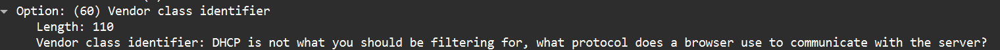

# Answers
Here you can find solutions and explanations if you get stuck!


## Stage 1 - Wireshark, HTTP cookies, SCAPY, PE format
Let us start by view the .pcapng file in wireshark to view the packets captured. We see the following:

In the back story we were told to focus on certain types of packets, here we can see that Ariel seemed to have been interested in ARP, DHCP and ICMP packets. Wireshark gives the ability to filter for certain packets within a capture, so let us do just that.

First we look at the ARP packets. ARP (Address Resolution Protocol) is a layer 2 protocol whose purpose is to find the MAC address of the device that has a certain IP address, as generally the requesting device and the requested device appear one the same local network. When we filter for ARP we see thousands of such packets. Wireshark gives us the ability to view the layers of a packet and when we do so with one of the filtered packets, we see the following:

We see a broadcast ARP packet, where the sending device sent the packet to every other device on the local network using the broadcast MAC address, trying to find out the IP address of a specific device. There's nothing particularly out of the ordinary here, however, wireshark gives us the ability to view the packets as raw bytes, and here we can see there seems to have been a secret payload attached to the packet when it was sent:


**ARP is not what you should you be filtering for, would you say that ‘The-Supermarket’ might be some sort of unique header?**

Now let's look at the DHCP packets. DHCP (Dynamic Host Configuration Protocol) is a layer 5 protocol, whose purpose is get an IP address for a device that just connected to a local network. When we filter for these packets we see again many DHCP discover requests, as many devices seem to be looking for the DHCP server to recieve and IP address for the network. Let us again view the layers of one of these packets and see if there are any secrets. We will notice, that there seems to be a secret in the *vendor class indetifier option* which generally indicates the hardware being used to help the DHCP server decide on configuration:


Finally let us look at the ICMP packets. ICMP (Internet Control Message Protocol) is a layer 3 protocol who's purpose is for error reporting and network diagnostics. When we filter for these packets, we see ICMP echo requests, where devices ask other devices to echo back the packet. So, this might indicate to us to check the payload to see what was the echo request:


**ICMP is not what you should be filtering for, what type of snack is an oreo?**

We finally now see what we should be filtering for: HTTP packets that contain the unique header field 'The-Supermarket', and we should focus on the cookies header. Simply this means we can use the filter 'http contains "The-Supermarket"'. We see the following with that filter:


We have a lot of communication between a client and server, so let us see at least one of these http streams. Wireshark allows us to do this by right clicking on a packet and selecting "follow http stream". We are greated with the following: 


There are a couple of things we need to notice: 
- Every single packet that was filtered for that appears for a stream like this
- The cookie seems unreasonably large, and seems to be base64 encoded (based on the appended =)
- The actual body of the response tells that this cookie is part of something bigger (specifically asscoiated with the chunk key)

So it seems like we need to extract all of this data. We have a problem however:


There are way to many packets for us to simply copy and paste from. Luckily a software/python library known as SCAPY provides provides not only a way to construct packets, but to filter through a capture as well. So using this library, we must filter for http responses, further filtering for the http responses that have the special "The-Supermaket" header. Afterwards, we must properly extract the cookie value associated with the key 'chunk' (this also requires the knowledge that cookies are generally consturcted out of key value pairs in the form **key=value;**) base64 decode them and write them to a file. A sample of a script that accomplishes this task can be found [here](extract_cookie.py), which should be run from the command line by passing the path to the wireshark file to it:
```cmd
python extract_cookie.py path/to/find_Ariel.pcapng
```
This script produces a file known as hidden_cookie.txt with the cookie values. Let us now inspect the file. Since the script wrote bytes to the file, it seems we need to use a hex editor to see the contents. Let's do just that:


With some knowledge regarding operating systems, we can see that this file is in PE format; it is an executable. We simply need to change the file extension from .txt to .exe. A sample of this rebuilt executable can be found [here](hidden_cookie.exe). Congragulations on completing the first stage!

## Stage 2 - DNS, Socket Programming, TLS certificates

Let's first run the executable and see what happens, the following is outputed to the terminal:


So our executable seems to be a client trying to send a file to the host student_finder.co.il using port 3000, but it can't because such a server does not exist. Maybe we can build our own server to have the executable sent to us. But how do we get the client connection to be routed to us? Generally the DNS protocol is responsible for mapping domain names to IP addresses. However we see that such a domain does not exist. However before the use of the DNS protocal, the windows operating system has a special file that it checks for host name resolution on the local machine. This file is located at **C:\Windows\System32\drivers\etc\hosts”**. We can update this file ourselves by mapping the the domain to localhost as so:


(note this can only be done with admin privileges).

Now we can write out own server running on localhost using port 3000 to recieve this file. The Socket library in python provides with ways to make sockets for such a connection. As we slowly build our server and receive and send messages from/to the client, we can see that the there is a 'special' protocol that it is following and we can update the server properly, and restart the client. When we finally recieve the file, we can see that it has the following form:


The client us a x509 cerificate in the PEM, (privacy enhanced mail) format. All we need to do know is write it to a .crt file. An example of script that accomplishes all of this can be found [here](certificate_reader.py), and a sample recreated certificate can be found [here](received_certificate.crt). 

Though windows provides a nice GUI for viewing certificates, seeing secrets buried within. Linux however provides us with with a wonderful tool in 'openssl', a library to handle TLS elements, to view all the information of a certificate. Using WSL (windows subsystem for linux). We can use the following command 
```bash
openssl x509 -in received_certificate.crt -text
```
We are specifying here to the openssl library to show us the x509 certificate from (-in) the file recieved_certificate.crt in a human readable format (-text).

Let us see what is displayed:


After a careful inspection we see there are three extensions that are labeled as critical, generally understood as required for use of the certificate:


Let us now visit this website and see what we need to do. Weren't we just told this domain does not exist in the previous stage? What has been happening with our executable, were we paying attention?


Congragulations on completing stage 2!

## Stage 3 - http query parameters

On initial visit to the website, we are greeted with the following page:


This came with the 401 error code for unauthorized. Seems like we need some sort of username and password. We were told already we were given the proper credentials to query with. Maybe we need to use query parameters with the http request, which is how one can filter for information with a get request. But what is the username and password we need? Did we forget about the other 2 critical extensions in our certificate? 


The username (base64 encoded key) is 'TeachersPet' and the password (base64 encoded key) is 'The_Best_Student'. So let us construct our url
**student_finder.co.il?username=TeachersPet&password=The_Best_Student**

We recieve the following page with a 200 success code, indicating we reached the solution


Seems like Ariel has one more trick up his sleeve. Congragulations on completing stage 3!


## Stage 4 - RSA encryption
Seems like Ariel sent us an encrypted message. Do you know who is the pictrue? It's Rivest, Shamir and Adleman, the inventors of RSA encryption. RSA encryption is built from a modulus, a public key for encrypting and a private key for decrypting. Were any of those things provided to us? Let us check out the text excerpt explaining the image:
- MODel: this sentence this sentence seems to contain 4 numbers throughout, 3 2 3 3, so 3233 is our modulus
- released to the public in 1960+17: Why split up the year 1977 like this, seems like our public key is 17

Let us now use the RSA algorithm to generate the private key.
1) First we must find the prime factors of the modulus, they are 53 and 61
2) Now we must compute the totient of the modulues, we get 52 X 60=3120
3) Now what is the first value z such that z X 17 mod 3120 = 1 such that z is also relatively prime with the totient, this number is 2753

With this public key we can use the following formula to decode each number in Ariel's message. Within RSA, this would be done by taking the value of *encrypted_number*^private_key mod modulus. This will get us the original value from the formula that gave us the encrypted number in *value*^public_key mod modulus.

After we decrpyt each number we can see that are ascii values, so we can convert them to their corresponding charachters accordingly. A script that automates entire process can be found [here](RSA_decryptor.py).

Here is Ariel's final message:
### Ariel didn't disappear, he graduated! He extends his heartfelt gratitude to his many teachers for all their guidance and hopes to make them proud as he embarks on his professional journey! Thank you for participating in this CTF, one of his final projects in school. 

Congragulations on completing stage 4 and completing the CTF challenge!


